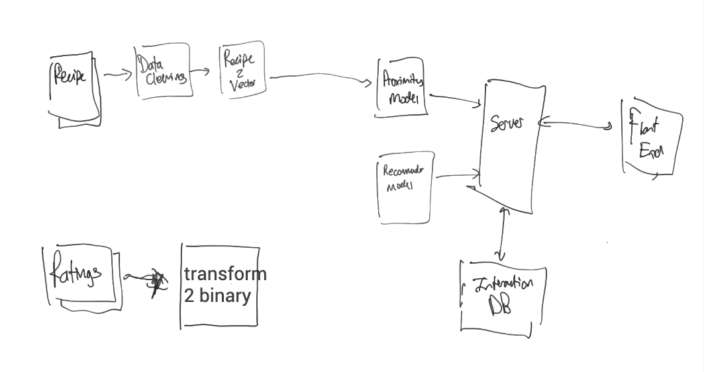

Oh no, I'm running out of time here. It took so long to actually load this editor and I've come out with nothing. What shall I do here?

Note: I should add the date here and also add some of this stuff to trello.

In my last meeting, we chatted and made a little architecture diagram. 

The main thing I should be focusing on here is going from the recipes to the proximity model. This will involve a few different modules or functions. We agreed that the dataset to use would be the [foodRecSys-V1 on kaggle](https://www.kaggle.com/elisaxxygao/foodrecsysv1). I can describe this dataset a bit later. Below I want to go through the modules.

- Recipe cleaner: Takes the recipes as input and output a cleaned set of recipes
- Recipe vectorizer: Takes the cleaned recipes as input and outputs a vector representation
    - This can first take form of a tfid thingy....this is what I shall start with
    - Or I could also use a word embedding algorithm to generate the vector representation.
- Proximity model: Takes as input a vectorized recipe and finds the nearest or most similar set of recipes

# From prior Lars meeting

Also to note from meeting with Lars there was a discussion of having 3 part blog series. The first could be an exploratory blog of the dataset. Another could be one testing a standard recommendation model on the data. And finally there could be one on a newer approach based on my inputs or interests.